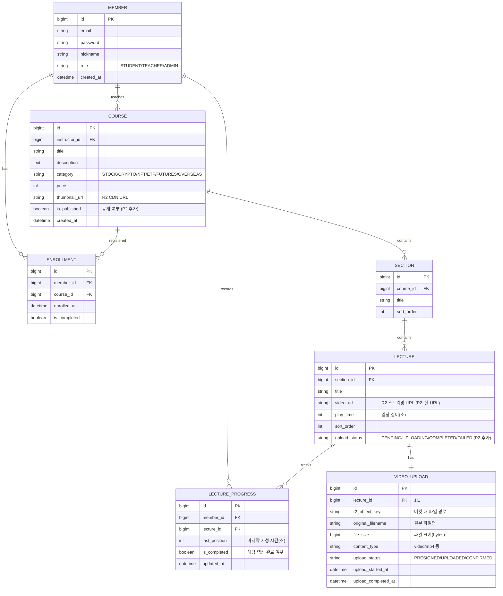

# [P2] StockFlow 프로젝트 통합 기획서 (강의자 중심 + Cloudflare R2 연동)

> **P1 달성**: 수강생 핵심 동선(탐색 → 상세 → 수강신청 → 영상 시청 → 마이페이지) MVP 완성  
> **P2 목표**: 강의자(TEACHER)가 강의를 직접 제작·관리하고, 실제 동영상을 업로드·스트리밍하는 완전한 콘텐츠 파이프라인 구축

---

## 1. 프로젝트 개요

### 1.1 P2 핵심 가치

P1이 **수강생이 콘텐츠를 소비하는 흐름**이었다면,  
P2는 **강의자가 콘텐츠를 생산·관리하는 흐름**을 완성합니다.

| 관점 | P1 (수강생) | P2 (강의자) |
|:---:|:---|:---|
| 핵심 액터 | STUDENT | TEACHER |
| 핵심 동선 | 탐색 → 수강 → 시청 | 업로드 → 편집 → 수강자 분석 |
| 스토리지 | videoUrl 하드코딩 | Cloudflare R2 실제 파일 업로드 |
| 데이터 흐름 | 소비(Read) | 생산(Write) + 분석(Read) |

### 1.2 P2 목표 기능 요약

1. **강의자 대시보드**: 내 강의 현황, 수강자 통계 한눈에 확인
2. **강의 콘텐츠 CRUD UI**: 강의·섹션·영상 생성/수정/삭제 (웹 UI)
3. **Cloudflare R2 실 동영상 업로드**: Pre-signed URL 방식, 원본 보호
4. **동영상 스트리밍**: R2 + Cloudflare Stream (또는 CDN) 연동
5. **수강자 관리**: 강의별 수강생 목록, 진도율 현황 조회

---

## 2. 개발 계획서 (2주 로드맵)

|   주차    |       단계        | 활동 내용                                               | 비고     |
| :-----: | :-------------: | :-------------------------------------------------- | :----- |
| **1주차** |   **인프라 설정**    | Cloudflare R2 버킷 생성, IAM 키 발급, Spring Boot SDK 연동   | 핵심 인프라 |
|         |   **업로드 API**   | Pre-signed URL 발급 API, 업로드 완료 콜백 처리, DB videoUrl 저장 | BE 핵심  |
|         |  **강의 관리 API**  | 강의·섹션·영상 CRUD 전용 API (TEACHER 권한 분리)                | 권한 설계  |
| **2주차** | **강의자 대시보드 UI** | 대시보드 페이지, 강의 목록/수정/삭제 UI                            | FE 핵심  |
|         |   **업로드 UI**    | 드래그앤드롭 파일 업로드, 진행률 표시, 썸네일 업로드                      | UX 완성  |
|         |  **수강자 분석 UI**  | 강의별 수강자 목록, 진도율 차트, 완강자 통계                          | 분석 기능  |
|         |   **QA 및 배포**   | 전체 시나리오 테스트 (강의자 동선), 리팩토링                          | P2 제출  |

---

## 3. 요구사항 명세서

| ID | 구분 | 요구사항 상세 | 수용 수준 |
|:---:|:---:|:---|:---:|
| **F-T01** | 강의자 대시보드 | 강의자는 자신이 개설한 강의 목록과 총 수강자 수를 한눈에 볼 수 있다 | 필수 |
| **F-T02** | 강의 생성 | 강의자는 강의 제목, 설명, 카테고리, 가격, 썸네일을 입력하여 강의를 개설한다 | 필수 |
| **F-T03** | 섹션 관리 | 강의자는 강의 내에 섹션을 추가/수정/삭제하고 순서를 조정할 수 있다 | 필수 |
| **F-T04** | 영상 업로드 | 강의자는 섹션 내 각 유닛에 실제 동영상 파일을 업로드할 수 있다 | 필수 |
| **F-T05** | 업로드 진행률 | 동영상 업로드 중 진행률(%)을 실시간으로 표시하며, 완료 시 알림을 제공한다 | 필수 |
| **F-T06** | 썸네일 업로드 | 강의자는 강의 썸네일 이미지를 직접 업로드할 수 있다 | 필수 |
| **F-T07** | 강의 수정/삭제 | 강의자는 자신의 강의 정보를 수정하거나 강의를 삭제할 수 있다 | 필수 |
| **F-T08** | 수강자 목록 | 강의자는 강의별 수강 중인 학생 목록(닉네임, 수강일, 진도율)을 볼 수 있다 | 필수 |
| **F-T09** | 진도율 현황 | 강의자는 영상별 평균 시청 완료율 및 완강자 수를 확인할 수 있다 | 선택 |
| **F-T10** | 강의 공개/비공개 | 강의자는 강의를 공개 또는 비공개 상태로 전환할 수 있다 | 선택 |
| **F-T11** | 동영상 미리보기 | 업로드된 영상이 스트리밍 가능한 상태인지 확인할 수 있다 | 선택 |

---

## 4. ERD 확장 (P1 → P2)

P1의 ERD를 그대로 유지하며 다음 테이블을 추가합니다.



### 4.1 변경 사항 요약

| 테이블 | 변경 내용 |
|:---|:---|
| `COURSE` | `is_published` 컬럼 추가 (공개/비공개 전환) |
| `LECTURE` | `upload_status` 컬럼 추가 (업로드 상태 추적) |
| `LECTURE_PROGRESS` | `is_completed` 컬럼 추가 (영상 단위 완료 여부) |
| `VIDEO_UPLOAD` | 신규 테이블 - R2 업로드 메타데이터 관리 |

---

## 5. Cloudflare R2 연동 설계

### 5.1 아키텍처 개요

```
강의자 브라우저
    │
    │ ① Pre-signed URL 요청
    ▼
Spring Boot BE ──→ Cloudflare R2 API ──→ Pre-signed URL 발급
    │                                          │
    │ ② Pre-signed URL 반환                   │
    ▼                                          │
강의자 브라우저 ───────────────────────────────┘
    │
    │ ③ 직접 PUT 업로드 (BE 미경유, 대용량 파일)
    ▼
Cloudflare R2 버킷 (원본 보관)
    │
    │ ④ 업로드 완료 콜백 (강의자 → BE)
    ▼
Spring Boot BE → lecture.videoUrl 업데이트 (CDN URL)
    │
    │ ⑤ 수강생 영상 재생
    ▼
수강생 브라우저 ──→ Cloudflare CDN (공개 읽기 URL) ──→ R2 버킷
```

**핵심 원칙**: 동영상 파일은 BE 서버를 **거치지 않고** 브라우저에서 R2로 직접 업로드 (Pre-signed URL 방식). BE 서버 부하 제거 및 대용량 파일 처리 가능.

### 5.2 Cloudflare R2 버킷 구성

```
stockflow-videos/              ← 영상 버킷 (비공개)
├── lectures/
│   ├── {lectureId}/
│   │   └── {uuid}.mp4
│
stockflow-thumbnails/          ← 썸네일 버킷 (공개)
├── courses/
│   ├── {courseId}/
│   │   └── thumbnail.{jpg|png|webp}
```

| 설정 항목 | 영상 버킷 | 썸네일 버킷 |
|:---|:---:|:---:|
| 공개 접근 | ❌ (Pre-signed URL만) | ✅ (CDN 공개) |
| CORS 설정 | PUT 허용 (업로드) | GET 허용 |
| 파일 크기 제한 | 최대 5GB | 최대 5MB |
| 허용 Content-Type | video/mp4, video/webm | image/jpeg, image/png, image/webp |

### 5.3 R2 환경 변수 설정 (application.yml)

```yaml
# application.yml (P2 추가)
cloudflare:
  r2:
    account-id: ${CF_ACCOUNT_ID}          # Cloudflare 계정 ID
    access-key-id: ${CF_R2_ACCESS_KEY}    # R2 API 토큰 Access Key
    secret-access-key: ${CF_R2_SECRET}    # R2 API 토큰 Secret
    video-bucket: stockflow-videos
    thumbnail-bucket: stockflow-thumbnails
    public-cdn-url: ${CF_CDN_URL}         # https://pub-xxxx.r2.dev (공개 도메인)
    presigned-url-expiry: 3600            # Pre-signed URL 유효시간 (초)
```

```
# .env (로컬 개발용, .gitignore에 반드시 추가)
CF_ACCOUNT_ID=your_account_id_here
CF_R2_ACCESS_KEY=your_access_key_here
CF_R2_SECRET=your_secret_key_here
CF_CDN_URL=https://pub-xxxxxxxxxxxx.r2.dev
```

### 5.4 Spring Boot R2 SDK 설정

```gradle
// build.gradle 추가 의존성
dependencies {
    // AWS S3 호환 SDK (Cloudflare R2는 S3 API 호환)
    implementation 'software.amazon.awssdk:s3:2.25.27'
    implementation 'software.amazon.awssdk:s3-transfer-manager:2.25.27'
}
```

```java
// R2Config.java
@Configuration
public class R2Config {

    @Value("${cloudflare.r2.account-id}")
    private String accountId;

    @Value("${cloudflare.r2.access-key-id}")
    private String accessKeyId;

    @Value("${cloudflare.r2.secret-access-key}")
    private String secretAccessKey;

    @Bean
    public S3Client r2Client() {
        return S3Client.builder()
            .endpointOverride(URI.create(
                "https://" + accountId + ".r2.cloudflarestorage.com"
            ))
            .credentialsProvider(StaticCredentialsProvider.create(
                AwsBasicCredentials.create(accessKeyId, secretAccessKey)
            ))
            .region(Region.of("auto"))
            .build();
    }

    @Bean
    public S3Presigner r2Presigner() {
        return S3Presigner.builder()
            .endpointOverride(URI.create(
                "https://" + accountId + ".r2.cloudflarestorage.com"
            ))
            .credentialsProvider(StaticCredentialsProvider.create(
                AwsBasicCredentials.create(accessKeyId, secretAccessKey)
            ))
            .region(Region.of("auto"))
            .build();
    }
}
```

---

## 6. API 명세

### 6.1 강의자 강의 관리 API

| 기능 | Method | Path | 권한 | 설명 |
|:---:|:---:|:---|:---:|:---|
| 내 강의 목록 | `GET` | `/api/v1/teacher/courses` | TEACHER | 강의자 본인의 강의 목록 + 수강자 수 |
| 강의 생성 | `POST` | `/api/v1/teacher/courses` | TEACHER | 신규 강의 개설 (썸네일 URL 포함) |
| 강의 수정 | `PUT` | `/api/v1/teacher/courses/{courseId}` | TEACHER(owner) | 강의 정보 수정 |
| 강의 삭제 | `DELETE` | `/api/v1/teacher/courses/{courseId}` | TEACHER(owner) | 강의 삭제 (수강자 없을 때만) |
| 강의 공개 전환 | `PATCH` | `/api/v1/teacher/courses/{courseId}/publish` | TEACHER(owner) | 공개/비공개 토글 |

### 6.2 섹션 관리 API

| 기능 | Method | Path | 권한 | 설명 |
|:---:|:---:|:---|:---:|:---|
| 섹션 생성 | `POST` | `/api/v1/teacher/courses/{courseId}/sections` | TEACHER(owner) | 섹션 추가 |
| 섹션 수정 | `PUT` | `/api/v1/teacher/sections/{sectionId}` | TEACHER(owner) | 섹션명, 순서 수정 |
| 섹션 삭제 | `DELETE` | `/api/v1/teacher/sections/{sectionId}` | TEACHER(owner) | 섹션 삭제 |
| 섹션 순서 변경 | `PATCH` | `/api/v1/teacher/courses/{courseId}/sections/reorder` | TEACHER(owner) | 섹션 순서 일괄 변경 |

### 6.3 영상 업로드 API (R2 연동)

| 기능 | Method | Path | 권한 | 설명 |
|:---:|:---:|:---|:---:|:---|
| Pre-signed URL 발급 | `POST` | `/api/v1/teacher/uploads/video-presigned` | TEACHER | R2 직접 업로드용 서명 URL 발급 |
| 업로드 완료 확인 | `POST` | `/api/v1/teacher/uploads/video-confirm` | TEACHER | 업로드 완료 후 lectureId와 연결 |
| 썸네일 Pre-signed URL | `POST` | `/api/v1/teacher/uploads/thumbnail-presigned` | TEACHER | 썸네일 이미지 업로드용 URL |
| 썸네일 완료 확인 | `POST` | `/api/v1/teacher/uploads/thumbnail-confirm` | TEACHER | 썸네일 URL을 강의에 저장 |
| 영상 유닛 추가 | `POST` | `/api/v1/teacher/sections/{sectionId}/lectures` | TEACHER(owner) | 영상 메타데이터 등록 |
| 영상 유닛 수정 | `PUT` | `/api/v1/teacher/lectures/{lectureId}` | TEACHER(owner) | 제목, 순서, 영상 URL 수정 |
| 영상 유닛 삭제 | `DELETE` | `/api/v1/teacher/lectures/{lectureId}` | TEACHER(owner) | 영상 유닛 삭제 (R2 파일도 삭제) |

### 6.4 수강자 분석 API

| 기능 | Method | Path | 권한 | 설명 |
|:---:|:---:|:---|:---:|:---|
| 강의별 수강자 목록 | `GET` | `/api/v1/teacher/courses/{courseId}/students` | TEACHER(owner) | 수강자 목록 + 진도율 |
| 영상별 시청 통계 | `GET` | `/api/v1/teacher/courses/{courseId}/stats` | TEACHER(owner) | 영상별 평균 진도율, 완강자 수 |
| 강의자 전체 통계 | `GET` | `/api/v1/teacher/dashboard` | TEACHER | 총 강의 수, 총 수강자 수, 완강자 수 |

### 6.5 주요 Request/Response 예시

#### POST `/api/v1/teacher/uploads/video-presigned`
```json
// Request Body
{
  "lectureId": 15,
  "filename": "lecture_01_intro.mp4",
  "contentType": "video/mp4",
  "fileSize": 524288000
}

// Response
{
  "uploadUrl": "https://xxxx.r2.cloudflarestorage.com/stockflow-videos/lectures/15/abc-uuid.mp4?X-Amz-Signature=...",
  "objectKey": "lectures/15/abc-uuid.mp4",
  "expiresAt": "2025-04-17T15:30:00Z",
  "maxFileSize": 5368709120
}
```

#### POST `/api/v1/teacher/uploads/video-confirm`
```json
// Request Body
{
  "lectureId": 15,
  "objectKey": "lectures/15/abc-uuid.mp4",
  "playTime": 1847
}

// Response
{
  "lectureId": 15,
  "videoUrl": "https://pub-xxxx.r2.dev/lectures/15/abc-uuid.mp4",
  "uploadStatus": "COMPLETED",
  "confirmedAt": "2025-04-17T14:28:00Z"
}
```

#### GET `/api/v1/teacher/courses/{courseId}/students`
```json
{
  "courseId": 5,
  "courseTitle": "주식 입문: 차트 분석 기초",
  "totalStudents": 47,
  "completedStudents": 12,
  "students": [
    {
      "memberId": 102,
      "nickname": "투자왕김철수",
      "enrolledAt": "2025-04-10T09:00:00Z",
      "overallProgress": 68.5,
      "lastActivityAt": "2025-04-16T21:30:00Z",
      "isCompleted": false
    }
  ]
}
```

---

## 7. 동영상 업로드 플로우 (상세)

### 7.1 단계별 플로우

```
[강의자 브라우저]                [Spring Boot BE]              [Cloudflare R2]
      │                                │                              │
      │ 1. 파일 선택 (drag & drop)      │                              │
      │                                │                              │
      │──POST /teacher/uploads/─────→  │                              │
      │   video-presigned              │                              │
      │   { lectureId, filename,       │                              │
      │     contentType, fileSize }    │                              │
      │                                │──generatePresignedUrl()─────→│
      │                                │←─ { uploadUrl, objectKey } ──│
      │←── { uploadUrl, objectKey } ───│                              │
      │                                │                              │
      │ 2. 직접 PUT 업로드 (대용량 가능) │                              │
      │────────────────PUT uploadUrl──────────────────────────────────→│
      │ (진행률: onUploadProgress 이벤트)│                              │
      │←─────────────────── 200 OK ───────────────────────────────────│
      │                                │                              │
      │ 3. 완료 신호 전송               │                              │
      │──POST /teacher/uploads/─────→  │                              │
      │   video-confirm                │──verifyObject()─────────────→│
      │   { lectureId, objectKey,      │←── metadata ─────────────────│
      │     playTime }                 │                              │
      │                                │ lecture.videoUrl = CDN URL   │
      │                                │ lecture.uploadStatus = DONE  │
      │←── { videoUrl, status } ───────│                              │
      │                                │                              │
      │ 4. 미리보기 재생 확인            │                              │
      │────────── GET CDN videoUrl ───────────────────────────────────→│
      │←────────── 영상 스트리밍 ──────────────────────────────────────│
```

### 7.2 업로드 상태 머신

```
PENDING → PRESIGNED → UPLOADING → UPLOADED → CONFIRMED
                                           ↘ FAILED (타임아웃/오류)
```

- **PENDING**: 강의 유닛 생성 직후 (영상 미업로드 상태)
- **PRESIGNED**: Pre-signed URL 발급 완료
- **UPLOADING**: 브라우저에서 업로드 진행 중 (BE는 모름, FE가 관리)
- **UPLOADED**: R2에 파일 도착 (브라우저가 200 OK 수신)
- **CONFIRMED**: BE가 R2 파일 존재 확인 후 videoUrl 저장 완료
- **FAILED**: Pre-signed URL 만료 또는 업로드 실패

### 7.3 R2 CORS 설정 (필수)

Cloudflare R2 대시보드 → 버킷 → CORS 정책 설정:

```json
[
  {
    "AllowedOrigins": [
      "http://localhost:3000",
      "https://stockflow.example.com"
    ],
    "AllowedMethods": ["PUT", "GET"],
    "AllowedHeaders": ["Content-Type", "Content-Length"],
    "ExposeHeaders": ["ETag"],
    "MaxAgeSeconds": 3600
  }
]
```

---

## 8. 프론트엔드 설계

### 8.1 라우팅 구조 (P2 추가)

```
/teacher
├── /dashboard              ← 강의자 홈 (총 수강자 수, 강의 목록 카드)
├── /courses
│   ├── /new                ← 강의 신규 생성 폼
│   └── /[courseId]
│       ├── /edit           ← 강의 기본 정보 수정
│       ├── /curriculum     ← 섹션/영상 편집 (드래그 순서 변경)
│       └── /students       ← 수강자 목록 & 진도율
```

### 8.2 주요 페이지 컴포넌트

#### `/teacher/dashboard`
```
┌─────────────────────────────────────────────┐
│  [강의자 대시보드]                            │
│  총 강의: 4개  │  총 수강자: 128명  │  완강: 31│
├─────────────────────────────────────────────┤
│  [+ 새 강의 만들기]                           │
├──────────┬──────────┬──────────┬────────────┤
│ 강의 카드 │ 강의 카드 │ 강의 카드 │ 강의 카드  │
│ 수강자:47 │ 수강자:23 │ 수강자:31 │ 수강자:27  │
│ [편집][분석]│[편집][분석]│[편집][분석]│[편집][분석]│
└──────────┴──────────┴──────────┴────────────┘
```

#### `/teacher/courses/[courseId]/curriculum`
```
┌──────────────────────────────────────────────┐
│  섹션 1: 주식 기초 이론          [섹션 편집] [+영상]│
│  ├── 1-1. 주식이란 무엇인가?  [COMPLETED] [편집]   │
│  │       영상: 14분 23초                          │
│  ├── 1-2. 계좌 개설 방법      [UPLOADING...]       │
│  │       ████████░░░░ 72%                         │
│  └── [+ 영상 추가]                                 │
│                                                   │
│  섹션 2: 차트 분석              [섹션 편집] [+영상] │
│  └── [+ 영상 추가]                                 │
│                                                   │
│  [+ 섹션 추가]                                    │
└──────────────────────────────────────────────────┘
```

#### 동영상 업로드 컴포넌트 (`VideoUploader`)
```typescript
// 핵심 업로드 로직 (FE)
async function uploadVideo(file: File, lectureId: number) {
  // 1. Pre-signed URL 발급
  const { uploadUrl, objectKey } = await api.post(
    '/teacher/uploads/video-presigned',
    { lectureId, filename: file.name, contentType: file.type, fileSize: file.size }
  );

  // 2. R2 직접 업로드 (진행률 추적)
  await axios.put(uploadUrl, file, {
    headers: { 'Content-Type': file.type },
    onUploadProgress: (e) => {
      const percent = Math.round((e.loaded * 100) / e.total!);
      setProgress(percent);  // 진행률 UI 업데이트
    },
  });

  // 3. BE에 완료 신호
  const { videoUrl } = await api.post('/teacher/uploads/video-confirm', {
    lectureId, objectKey, playTime: await getVideoDuration(file)
  });

  return videoUrl;
}
```

### 8.3 API 클라이언트 추가 (`lib/api/teacher.ts`)

```typescript
// P2 추가: 강의자 전용 API 모듈
export const teacherApi = {
  getDashboard: () => api.get('/teacher/dashboard'),
  getMyCourses: () => api.get('/teacher/courses'),
  createCourse: (data: CourseCreateRequest) => api.post('/teacher/courses', data),
  updateCourse: (id: number, data: CourseUpdateRequest) => api.put(`/teacher/courses/${id}`, data),
  deleteCourse: (id: number) => api.delete(`/teacher/courses/${id}`),
  publishCourse: (id: number) => api.patch(`/teacher/courses/${id}/publish`),

  createSection: (courseId: number, data: SectionRequest) =>
    api.post(`/teacher/courses/${courseId}/sections`, data),
  updateSection: (id: number, data: SectionRequest) => api.put(`/teacher/sections/${id}`, data),
  deleteSection: (id: number) => api.delete(`/teacher/sections/${id}`),

  getVideoPresignedUrl: (data: VideoPresignedRequest) =>
    api.post('/teacher/uploads/video-presigned', data),
  confirmVideoUpload: (data: VideoConfirmRequest) =>
    api.post('/teacher/uploads/video-confirm', data),
  getThumbnailPresignedUrl: (data: ThumbnailPresignedRequest) =>
    api.post('/teacher/uploads/thumbnail-presigned', data),

  getCourseStudents: (courseId: number) => api.get(`/teacher/courses/${courseId}/students`),
  getCourseStats: (courseId: number) => api.get(`/teacher/courses/${courseId}/stats`),
};
```

---

## 9. 보안 고려사항

### 9.1 R2 접근 제어

| 위협 | 대응 방법 |
|:---|:---|
| 타인이 Pre-signed URL 재사용 | URL 유효시간 1시간 제한 |
| 악의적 파일 업로드 | Content-Type 화이트리스트 검증 (video/mp4, video/webm만 허용) |
| 용량 초과 업로드 | Pre-signed URL 생성 시 `ContentLengthRange` 제한 (최대 5GB) |
| 비인가 영상 접근 | 영상 버킷은 Private, 수강 여부 확인 후 별도 Signed URL 발급 |
| 타 강의자 파일 덮어쓰기 | objectKey에 lectureId + UUID 포함, 소유권 검증 |

### 9.2 API 권한 검증

```
TEACHER 권한:
  - 본인이 소유한 강의(course.instructorId == currentUser.id)만 수정 가능
  - 소유권 검증 실패 시 403 Forbidden 반환

Pre-signed URL 발급:
  - lectureId가 본인 강의 소속인지 확인
  - 검증 통과 후에만 R2 API 호출
```

---

## 10. P3 예고 (향후 확장)

P2를 통해 강의자 생태계가 완성되면, P3에서는 다음 기능을 추가합니다.

| P3 기능 | 설명 |
|:---|:---|
| **결제 연동** | 강의 가격 설정 + 토스페이먼츠/카카오페이 결제 |
| **수익 정산** | 강의자 수익 대시보드, 정산 내역 조회 |
| **관리자 기능** | 전체 회원/강의 관리, 신고 처리, 강의 검수 |
| **알림 시스템** | 새 수강자 알림, 강의 완료 알림 (WebSocket/SSE) |
| **Cloudflare Stream 전환** | R2 단순 저장 → Stream (HLS 자동 변환, 썸네일 추출) |
| **배치 처리** | 진도율 집계 스케줄러, 정산 배치 (Spring Batch) |

---

## 11. 개발 환경 세팅 가이드

### 11.1 Cloudflare R2 세팅 순서

1. [Cloudflare 대시보드](https://dash.cloudflare.com) → R2 → 버킷 2개 생성
   - `stockflow-videos` (Private)
   - `stockflow-thumbnails` (Public)

2. R2 → 개요 → API 토큰 생성
   - 권한: `Object Read & Write`
   - 버킷: 위 2개 선택
   - Access Key ID, Secret Access Key 복사

3. `stockflow-thumbnails` 버킷 → 설정 → 공개 액세스 허용
   - Public R2.dev 서브도메인 활성화

4. 각 버킷 → 설정 → CORS → 위 7.3의 정책 적용

5. `.env` 파일에 발급받은 키 입력

### 11.2 로컬 테스트 방법

```bash
# BE 실행 (R2 키 환경변수 필요)
cd BE
./gradlew bootRun

# FE 실행
cd fe
npm run dev

# 테스트 시나리오
# 1. TEACHER 계정으로 로그인
# 2. /teacher/courses/new 에서 강의 생성
# 3. /teacher/courses/{id}/curriculum 에서 섹션 추가
# 4. 영상 파일 업로드 → 진행률 확인 → 완료
# 5. 생성된 강의를 STUDENT 계정으로 수강신청 → 영상 재생 확인
```

---

*이 기획서는 P1(수강생 동선) 완성을 전제로 작성되었습니다.*  
*P2 완료 후 P3(결제/관리자)로 확장됩니다.*
