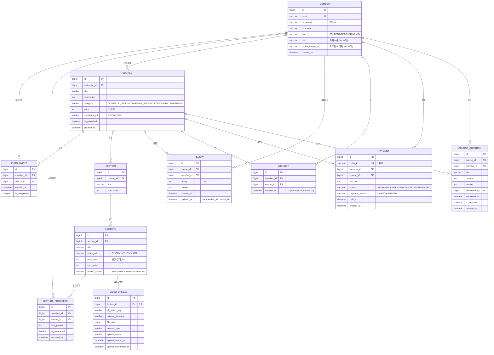

# [P2] StockClass 프로젝트 통합 기획서

> **P1 달성**: 수강생 핵심 동선(탐색 → 상세 → 수강신청 → 영상 시청 → 마이페이지) MVP 완성  
> **P2 목표**: 강의자 콘텐츠 파이프라인 완성 + 플랫폼 완성도 전반 향상 (리뷰, 찜, 결제, 진도관리, UI 리디자인)

---

## 1. 프로젝트 개요

### 1.1 P2 핵심 가치

| 관점 | P1 (수강생 소비) | P2 (플랫폼 완성) |
|:---:|:---|:---|
| 핵심 액터 | STUDENT | TEACHER + STUDENT (양방향) |
| 핵심 동선 | 탐색 → 수강 → 시청 | 업로드/관리 + 리뷰/Q&A + 결제/수료 |
| 스토리지 | videoUrl 하드코딩 | Cloudflare R2 실 파일 업로드 |
| UI | 다크 테마 (AI 생성) | 라이트 클린 테마 (인프런 스타일) |

### 1.2 P2 구현 기능 요약

**강의자(TEACHER) 기능**
1. 강의자 대시보드: 내 강의 현황, 수강자·완강자 통계
2. 강의 CRUD: 제목/설명/카테고리/가격/공개여부 관리
3. Cloudflare R2 영상 업로드: Pre-signed URL 방식 (3단계 파이프라인)
4. 썸네일 직접 업로드: R2 Pre-signed URL 방식
5. 섹션/강의 유닛 관리: 추가/수정/삭제/순서 조정
6. 수강자 목록 및 진도율 통계
7. Q&A 답변 관리: 수강생 질문 확인 및 답변 등록/수정

**수강생(STUDENT) 기능**
1. 강의 탐색: 키워드 검색, 카테고리 필터, 정렬(최신/인기/가격/무료)
2. 강사별 페이지: 특정 강사의 강의 목록
3. 리뷰/별점: 수강 후기 등록, 수정, 평균 별점 표시
4. 강의 Q&A: 질문 등록, 강사 답변 확인
5. 찜 목록: 관심 강의 저장/해제, 목록 관리
6. 결제 (더미): 유료 강의 결제 시뮬레이션, 결제 내역 조회
7. 진도율 관리: 강의별 완강 표시, 전체 수강률 확인
8. 완강 처리 & 수료증: 모든 강의 완료 시 배너 팝업 + 수료증 발급
9. 프로필 관리: 닉네임 변경, 비밀번호 변경, 계정 탈퇴

**UX/공통**
1. 라이트 테마 전체 리디자인: 모든 페이지 밝고 깔끔한 테마
2. 에러 페이지: 404, 500(Error Boundary)
3. 헤더 내비게이션 개선: 찜 목록, 결제 내역, 프로필 링크

---

## 2. 개발 계획서

| 구분 | 내용 | 상태 |
|:---:|:---|:---:|
| **인프라** | Cloudflare R2 버킷 연동, Spring Boot AWS S3 SDK | ✅ 완료 |
| **R2 버그 수정** | ERR_SSL_VERSION_OR_CIPHER_MISMATCH → path-style URL 전환 | ✅ 완료 |
| **강의자 BE** | 강의 CRUD, 섹션/강의 유닛, R2 업로드, 수강자 통계 API | ✅ 완료 |
| **강의자 FE** | 대시보드, 강의 관리, 썸네일/영상 업로드 UI | ✅ 완료 |
| **리뷰 시스템** | BE 엔티티 + API + FE 컴포넌트 (별점, 분포) | ✅ 완료 |
| **Q&A 시스템** | BE 엔티티 + API + 수강생 질문 + 강사 답변 관리 UI | ✅ 완료 |
| **찜(위시리스트)** | BE 엔티티 + API + FE 목록/토글 | ✅ 완료 |
| **결제 (더미)** | BE 결제 엔티티 + API + FE 결제/내역 UI | ✅ 완료 |
| **진도 관리** | 완강 표시 낙관적 업데이트, 완강 배너, 수료증 | ✅ 완료 |
| **프로필** | 닉네임/비밀번호 변경, 계정 탈퇴 | ✅ 완료 |
| **UI 리디자인** | 전체 페이지 다크 → 라이트 테마 | ✅ 완료 |

---

## 3. 요구사항 명세서

### 3.1 강의자 요구사항

| ID | 구분 | 요구사항 | 수용 수준 | 상태 |
|:---:|:---:|:---|:---:|:---:|
| F-T01 | 대시보드 | 강의자는 총 강의 수, 수강자 수, 완강자 수를 한눈에 볼 수 있다 | 필수 | ✅ |
| F-T02 | 강의 생성 | 강의자는 제목, 설명, 카테고리, 가격, 썸네일을 입력하여 강의를 개설한다 | 필수 | ✅ |
| F-T03 | 섹션 관리 | 강의자는 강의 내 섹션을 추가/수정/삭제하고 순서를 조정할 수 있다 | 필수 | ✅ |
| F-T04 | 영상 업로드 | 강의자는 R2 Pre-signed URL 방식으로 동영상 파일을 업로드한다 | 필수 | ✅ |
| F-T05 | URL 입력 | 강의자는 YouTube 등 외부 URL을 영상으로 등록할 수 있다 | 필수 | ✅ |
| F-T06 | 썸네일 업로드 | 강의자는 썸네일 이미지를 직접 업로드할 수 있다 (R2) | 필수 | ✅ |
| F-T07 | 강의 수정/삭제 | 강의자는 자신의 강의 정보를 수정하거나 삭제할 수 있다 | 필수 | ✅ |
| F-T08 | 수강자 목록 | 강의자는 강의별 수강생 닉네임, 수강일, 진도율을 볼 수 있다 | 필수 | ✅ |
| F-T09 | 통계 현황 | 강의자는 영상별 조회수, 완강자 수를 확인할 수 있다 | 선택 | ✅ |
| F-T10 | 공개/비공개 | 강의자는 강의를 공개/비공개 상태로 전환할 수 있다 | 선택 | ✅ |
| F-T11 | Q&A 관리 | 강의자는 수강생 질문을 확인하고 답변을 등록/수정할 수 있다 | 선택 | ✅ |

### 3.2 수강생 요구사항

| ID | 구분 | 요구사항 | 수용 수준 | 상태 |
|:---:|:---:|:---|:---:|:---:|
| F-S01 | 강의 탐색 | 키워드 검색, 카테고리 필터, 정렬(최신/인기/가격)으로 강의를 찾을 수 있다 | 필수 | ✅ |
| F-S02 | 강사 페이지 | 강사 이름을 클릭하면 해당 강사의 강의 목록 페이지로 이동한다 | 선택 | ✅ |
| F-S03 | 수강신청 | 수강생은 강의 상세에서 수강신청을 할 수 있다 (TEACHER 계정 불가) | 필수 | ✅ |
| F-S04 | 영상 시청 | 수강생은 R2 CDN 및 YouTube 영상을 학습 페이지에서 시청한다 | 필수 | ✅ |
| F-S05 | 완강 표시 | 수강생은 개별 강의를 완강 표시할 수 있다 (낙관적 업데이트) | 필수 | ✅ |
| F-S06 | 완강 배너 | 모든 강의 완료 시 팝업이 나타나고 완강 처리 및 강의 나가기를 안내한다 | 필수 | ✅ |
| F-S07 | 수료증 | 완강 처리 후 수료증을 발급받고 조회할 수 있다 | 선택 | ✅ |
| F-S08 | 리뷰/별점 | 수강생은 강의에 별점과 후기를 등록/수정할 수 있다 | 선택 | ✅ |
| F-S09 | Q&A | 수강생은 강의에 질문을 등록하고 강사 답변을 확인할 수 있다 | 선택 | ✅ |
| F-S10 | 찜 목록 | 수강생은 관심 강의를 찜하고 목록을 관리할 수 있다 | 선택 | ✅ |
| F-S11 | 결제 | 수강생은 유료 강의를 결제(더미)하고 내역을 조회할 수 있다 | 선택 | ✅ |
| F-S12 | 프로필 관리 | 수강생은 닉네임, 비밀번호를 변경하고 계정을 탈퇴할 수 있다 | 선택 | ✅ |

---

## 4. ERD (Entity Relationship Diagram)

### 4.1 전체 ERD



### 4.2 P2 신규/변경 테이블

| 테이블 | 구분 | 변경 내용 |
|:---|:---:|:---|
| `MEMBER` | 변경 | `bio`, `profile_image_url` 컬럼 추가 |
| `REVIEW` | **신규** | 강의 리뷰/별점. `(member_id, course_id)` 복합 Unique |
| `WISHLIST` | **신규** | 찜 목록. `(member_id, course_id)` 복합 Unique |
| `PAYMENT` | **신규** | 결제 내역 (더미). 상태 Enum 관리 |
| `COURSE_QUESTION` | **신규** | 강의 Q&A. 강사 답변 인라인 저장 |

---

## 5. Cloudflare R2 연동 설계

### 5.1 아키텍처 및 버그 수정 이력

**핵심 이슈 (해결 완료)**: `ERR_SSL_VERSION_OR_CIPHER_MISMATCH`  
- 원인: AWS SDK 기본 virtual-hosted-style URL(`bucket.accountId.r2.cloudflarestorage.com`)은 2단계 서브도메인으로 Cloudflare R2의 와일드카드 SSL 인증서(`*.r2.cloudflarestorage.com`)와 불일치
- 해결: `S3Configuration.builder().pathStyleAccessEnabled(true)` 적용 (S3Client, S3Presigner 모두)

```java
// R2Config.java — 핵심 설정
.serviceConfiguration(S3Configuration.builder()
    .pathStyleAccessEnabled(true)
    .build())
```

### 5.2 업로드 3단계 파이프라인

```
브라우저
  │ ① POST /api/v1/teacher/uploads/video-presigned
  │    { lectureId, filename, contentType, fileSize }
  ▼
Spring Boot BE ──generatePresignedUrl()──▶ R2
  │◀── { uploadUrl, objectKey, expiresAt }
  ▼
브라우저
  │ ② PUT uploadUrl (직접 업로드, BE 미경유)
  │    Headers: Content-Type
  ▼
Cloudflare R2 버킷
  │ ③ POST /api/v1/teacher/uploads/video-confirm
  │    { lectureId, objectKey, playTime }
  ▼
Spring Boot BE ──headObject() 확인──▶ R2
  │ lecture.videoUrl = CDN URL 저장
  ▼
수강생 브라우저 ──▶ Cloudflare CDN ──▶ R2 (스트리밍)
```

### 5.3 버킷 구성

```
stockclass/                     ← 단일 버킷 (공개 CDN)
├── lectures/{lectureId}/{uuid}.mp4    ← 강의 영상
└── courses/{courseId}/thumbnail.{ext} ← 썸네일
```

| 항목 | 설정값 |
|:---|:---|
| 공개 접근 | Cloudflare CDN (Public R2.dev 서브도메인) |
| URL 방식 | Path-style (`accountId.r2.cloudflarestorage.com/bucket/key`) |
| 영상 최대 크기 | 5GB |
| 썸네일 최대 크기 | 5MB |
| 허용 영상 타입 | video/mp4, video/webm |
| 허용 이미지 타입 | image/jpeg, image/png, image/webp |
| Pre-signed URL 유효시간 | 3600초 (1시간) |

---

## 6. API 명세

> Base URL: `http://localhost:8080/api`

### 6.1 인증 API (`/auth`)

| Method | Path | 설명 |
|:---:|:---|:---|
| POST | `/auth/signup` | 회원가입 |
| POST | `/auth/login` | 로그인 (JWT 발급) |
| POST | `/auth/refresh` | 토큰 갱신 |
| GET | `/auth/check-email` | 이메일 중복 확인 |

### 6.2 회원 프로필 API (`/members`) — P2 신규

| Method | Path | 권한 | 설명 |
|:---:|:---|:---:|:---|
| GET | `/members/me` | 인증 | 내 프로필 조회 |
| PUT | `/members/me` | 인증 | 닉네임, 자기소개 수정 |
| PUT | `/members/me/password` | 인증 | 비밀번호 변경 |
| DELETE | `/members/me` | 인증 | 회원 탈퇴 |

### 6.3 강의 공개 API (`/courses`)

| Method | Path | 권한 | 설명 |
|:---:|:---|:---:|:---|
| GET | `/courses` | 공개 | 강의 목록 (페이지네이션) |
| GET | `/courses/{id}` | 공개 | 강의 상세 |
| GET | `/courses/search` | 공개 | 키워드·카테고리 검색 |
| GET | `/courses/category/{category}` | 공개 | 카테고리별 목록 |
| GET | `/courses/instructor/{id}` | 공개 | 강사별 강의 목록 |

### 6.4 섹션/강의 API (`/sections`)

| Method | Path | 권한 | 설명 |
|:---:|:---|:---:|:---|
| GET | `/sections/courses/{courseId}` | 공개 | 코스별 섹션+강의 목록 |
| GET | `/sections/{sectionId}/lectures` | 공개 | 섹션별 강의 목록 |
| GET | `/sections/lectures/{lectureId}` | 공개 | 강의 단건 조회 |

### 6.5 수강신청 API (`/enrollments`)

| Method | Path | 권한 | 설명 |
|:---:|:---|:---:|:---|
| POST | `/enrollments` | 인증 | 수강신청 |
| GET | `/enrollments/my` | 인증 | 내 수강 목록 |
| PUT | `/enrollments/courses/{courseId}/complete` | 인증 | 완강 처리 |

### 6.6 학습 진도 API (`/lecture-progress`)

| Method | Path | 권한 | 설명 |
|:---:|:---|:---:|:---|
| POST | `/lecture-progress` | 인증 | 진도 저장 (lastPosition) |
| GET | `/lecture-progress/lectures/{lectureId}` | 인증 | 특정 강의 진도 조회 |
| GET | `/lecture-progress/my` | 인증 | 내 전체 진도 목록 |
| DELETE | `/lecture-progress/lectures/{lectureId}` | 인증 | 진도 초기화 |

### 6.7 리뷰 API (`/courses/{courseId}/reviews`) — P2 신규

| Method | Path | 권한 | 설명 |
|:---:|:---|:---:|:---|
| GET | `/courses/{id}/reviews` | 공개 | 리뷰 목록 |
| GET | `/courses/{id}/reviews/summary` | 공개 | 평균 별점, 분포 |
| POST | `/courses/{id}/reviews` | 인증 | 리뷰 등록 (작성 이력 있으면 수정) |
| DELETE | `/courses/{id}/reviews` | 인증(작성자) | 리뷰 삭제 |

### 6.8 Q&A API (`/courses/{courseId}/questions`) — P2 신규

| Method | Path | 권한 | 설명 |
|:---:|:---|:---:|:---|
| GET | `/courses/{id}/questions` | 공개 | 질문 목록 |
| POST | `/courses/{id}/questions` | 인증 | 질문 등록 |
| POST | `/courses/{id}/questions/{qId}/answer` | TEACHER | 답변 등록/수정 |
| DELETE | `/courses/{id}/questions/{qId}` | 인증(작성자/강사) | 질문 삭제 |

### 6.9 찜 API (`/wishlist`) — P2 신규

| Method | Path | 권한 | 설명 |
|:---:|:---|:---:|:---|
| GET | `/wishlist` | 인증 | 내 찜 목록 |
| POST | `/wishlist/{courseId}` | 인증 | 찜 토글 (찜/해제) |
| GET | `/wishlist/{courseId}/status` | 인증 | 찜 여부 확인 |

### 6.10 결제 API (`/payments`) — P2 신규 (더미)

| Method | Path | 권한 | 설명 |
|:---:|:---|:---:|:---|
| POST | `/payments` | 인증 | 결제 생성 (더미) |
| GET | `/payments/my` | 인증 | 내 결제 내역 |

### 6.11 강의자 전용 API (`/v1/teacher`) — P2

| Method | Path | 권한 | 설명 |
|:---:|:---|:---:|:---|
| GET | `/v1/teacher/dashboard` | TEACHER | 전체 통계 |
| GET | `/v1/teacher/courses` | TEACHER | 내 강의 목록 |
| POST | `/v1/teacher/courses` | TEACHER | 강의 생성 |
| PUT | `/v1/teacher/courses/{id}` | TEACHER(owner) | 강의 수정 |
| DELETE | `/v1/teacher/courses/{id}` | TEACHER(owner) | 강의 삭제 |
| PATCH | `/v1/teacher/courses/{id}/publish` | TEACHER(owner) | 공개/비공개 토글 |
| POST | `/v1/teacher/courses/{id}/sections` | TEACHER(owner) | 섹션 추가 |
| PATCH | `/v1/teacher/courses/{id}/sections/reorder` | TEACHER(owner) | 섹션 순서 변경 |
| PUT | `/v1/teacher/sections/{id}` | TEACHER(owner) | 섹션 수정 |
| DELETE | `/v1/teacher/sections/{id}` | TEACHER(owner) | 섹션 삭제 |
| POST | `/v1/teacher/sections/{id}/lectures` | TEACHER(owner) | 강의 유닛 추가 |
| PUT | `/v1/teacher/lectures/{id}` | TEACHER(owner) | 강의 유닛 수정 |
| DELETE | `/v1/teacher/lectures/{id}` | TEACHER(owner) | 강의 유닛 삭제 |
| POST | `/v1/teacher/uploads/video-presigned` | TEACHER | 영상 Pre-signed URL 발급 |
| POST | `/v1/teacher/uploads/video-confirm` | TEACHER | 영상 업로드 완료 확인 |
| POST | `/v1/teacher/uploads/thumbnail-presigned` | TEACHER | 썸네일 Pre-signed URL 발급 |
| POST | `/v1/teacher/uploads/thumbnail-confirm` | TEACHER | 썸네일 업로드 완료 확인 |
| GET | `/v1/teacher/courses/{id}/students` | TEACHER(owner) | 수강자 목록 + 진도율 |
| GET | `/v1/teacher/courses/{id}/stats` | TEACHER(owner) | 강의별 통계 |

---

## 7. 프론트엔드 설계 (Next.js 16 App Router)

### 7.1 전체 라우팅 구조

```
app/
├── page.tsx                          ← 홈 (강의 목록, 검색, 정렬, 카테고리 필터)
├── not-found.tsx                     ← 404 페이지
├── error.tsx                         ← 500 Error Boundary
│
├── auth/
│   ├── login/page.tsx                ← 로그인
│   └── signup/page.tsx               ← 회원가입
│
├── profile/page.tsx                  ← 내 프로필 (닉네임/비밀번호 변경, 탈퇴) [신규]
│
├── courses/[id]/page.tsx             ← 강의 상세 (리뷰, Q&A, 찜 버튼) [확장]
│
├── instructor/[id]/page.tsx          ← 강사 프로필 + 강사 강의 목록 [신규]
│
├── payment/[courseId]/page.tsx       ← 결제 페이지 (더미) [신규]
├── payments/page.tsx                 ← 결제 내역 [신규]
│
├── wishlist/page.tsx                 ← 찜 목록 [신규]
│
├── my-courses/page.tsx               ← 내 강의실
├── learning/
│   ├── [courseId]/page.tsx           ← 강의 목록 / 첫 강의로 리다이렉트
│   └── [courseId]/[lectureId]/page.tsx ← 강의 학습 플레이어 (진도, 완강 배너) [확장]
├── certificate/[courseId]/page.tsx   ← 수료증 [신규]
│
└── teacher/
    ├── dashboard/page.tsx            ← 강의자 대시보드
    ├── courses/
    │   ├── page.tsx                  ← 내 강의 목록
    │   ├── new/page.tsx              ← 강의 생성
    │   └── [id]/
    │       ├── edit/page.tsx         ← 강의 수정 (썸네일 직접 업로드)
    │       ├── manage/page.tsx       ← 섹션/영상 관리 (R2 업로드)
    │       ├── students/page.tsx     ← 수강자 목록
    │       └── questions/page.tsx    ← Q&A 관리 [신규]
```

### 7.2 UI 테마 (라이트 클린)

P2에서 전체 UI를 다크 테마에서 라이트 클린 테마로 리디자인했습니다.

| 역할 | 다크 (P1) | 라이트 (P2) |
|:---|:---|:---|
| 메인 배경 | `#0a0a0d` | `#f4f4f8` |
| 카드/패널 | `#131318` | `#ffffff` |
| Elevated | `#1d1d25` | `#f0f0f8` |
| 테두리 | `#2d2d38` | `#e2e2ea` |
| 주요 텍스트 | `#f2f2f5` | `#18181b` |
| 보조 텍스트 | `#8c8c9e` | `#6b6b7b` |
| 뮤트 텍스트 | `#52525e` | `#9898a8` |
| 골드 액센트 | `#e9a000` | `#e9a000` (유지) |

### 7.3 학습 플레이어 완강 플로우

```
수강생 학습 중
  │
  │ 개별 강의 "완강 표시" 클릭
  ▼
낙관적 업데이트 (즉시 체크 표시) ──▶ API 백그라운드 동기화
  │
  │ 모든 강의 완료
  ▼
완강 축하 팝업 (자동)
  ├── "완강하기 & 수료증 받기" ──▶ 완강 API ──▶ /certificate/{courseId}
  ├── "내 강의실로 돌아가기" ──▶ /my-courses
  └── "계속 강의 보기" (팝업 닫기)
```

---

## 8. 보안 고려사항

| 위협 | 대응 |
|:---|:---|
| Pre-signed URL 재사용 | 유효시간 1시간 제한 |
| 악의적 파일 업로드 | Content-Type 화이트리스트 (video/mp4, video/webm, image/\*) |
| 용량 초과 업로드 | Pre-signed URL 발급 시 최대 5GB 검증 |
| R2 SSL 불일치 | path-style URL 강제 적용 (`pathStyleAccessEnabled(true)`) |
| 타 강의자 강의 수정 | `instructorId == currentMemberId` 소유권 검증 → 403 |
| TEACHER 계정 수강신청 | FE 및 BE 양쪽에서 TEACHER 역할 차단 |
| 본인 리뷰만 삭제 | `memberId == currentMemberId` 검증 |

---

## 9. 개발 환경

### 9.1 기술 스택

| 레이어 | 기술 |
|:---|:---|
| Frontend | Next.js 16.2.1 (App Router), React 19, TypeScript, Tailwind CSS 4 |
| Backend | Spring Boot 3, Spring Security (JWT), JPA/Hibernate |
| Database | MySQL (로컬 개발) |
| Storage | Cloudflare R2 (AWS S3 호환 SDK, path-style) |
| 인증 | JWT (Access Token + Refresh Token, localStorage) |

### 9.2 로컬 실행

```bash
# Backend
cd BE
./gradlew bootRun

# Frontend
cd fe
npm install
npm run dev
```

### 9.3 환경변수 (application.yml)

```yaml
cloudflare:
  r2:
    account-id: ${CF_ACCOUNT_ID}
    access-key-id: ${CF_R2_ACCESS_KEY}
    secret-access-key: ${CF_R2_SECRET}
    bucket: stockclass
    public-cdn-url: ${CF_CDN_URL}
    presigned-url-expiry: 3600
```

### 9.4 DB 마이그레이션 체크리스트 (P2)

- [x] `member` 테이블: `bio`, `profile_image_url` 컬럼 추가
- [x] `course` 테이블: `is_published` 컬럼 추가
- [x] `lecture` 테이블: `upload_status` 컬럼 추가
- [x] `lecture_progress` 테이블: `is_completed` 컬럼 추가
- [x] `video_upload` 테이블 신규 생성
- [x] `review` 테이블 신규 생성
- [x] `wishlist` 테이블 신규 생성
- [x] `payment` 테이블 신규 생성
- [x] `course_question` 테이블 신규 생성

> `spring.jpa.hibernate.ddl-auto: update` 설정으로 앱 시작 시 자동 마이그레이션됩니다.

---

## 10. 알려진 제한사항 및 향후 과제

| 항목 | 현황 | 향후 |
|:---|:---|:---|
| 결제 | 더미 구현 (실제 PG 연동 없음) | 토스페이먼츠/카카오페이 연동 |
| 소셜 로그인 | 미구현 (이메일+비밀번호만) | Google, Kakao OAuth2 |
| 알림 시스템 | 미구현 | WebSocket/SSE 기반 인앱 알림 |
| 관리자 페이지 | 미구현 (ADMIN 역할만 존재) | 회원 관리, 강의 검수, 통계 |
| 영상 배속/자막 | 브라우저 기본 기능만 | 커스텀 플레이어 |
| 최근 본 강의 | 미구현 | localStorage 기반 |
| 반응형 (모바일) | 기본 레이아웃만 | 플레이어 모바일 최적화 |

---

*P1(수강생 소비 동선) 완성을 기반으로 P2에서 플랫폼 전체 기능을 완성했습니다.*
